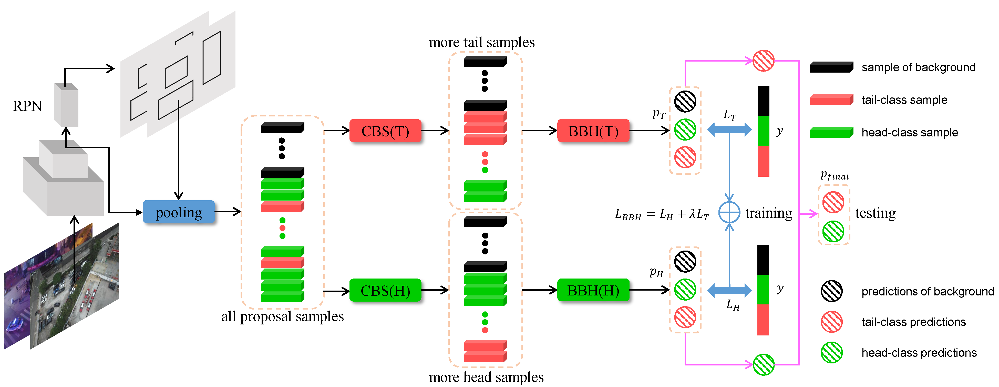

# Towards Resolving the Challenge of Long-tail Distribution in UAV Images for Object Detection

## Introduction
This repo is the implementation for WACV 2021 paper: **Towards Resolving the Challenge of Long-tail Distribution in UAV Images for Object Detection**.

## Requirements
### 1. Environment:
The requirements are exactly the same as [mmdetection v2.3.0rc0+8194b16](https://github.com/open-mmlab/mmdetection/tree/v2.3.0). We tested on on the following settings:

- python 3.7.7
- cuda 10.1
- pytorch 1.5.0 
- torchvision 0.6.0
- mmcv 1.0.4

With settings above, please refer to [offical guide of mmdetection](https://github.com/open-mmlab/mmdetection/blob/v2.3.0/docs/install.md) for installation.
